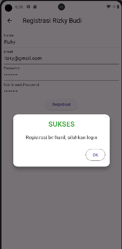
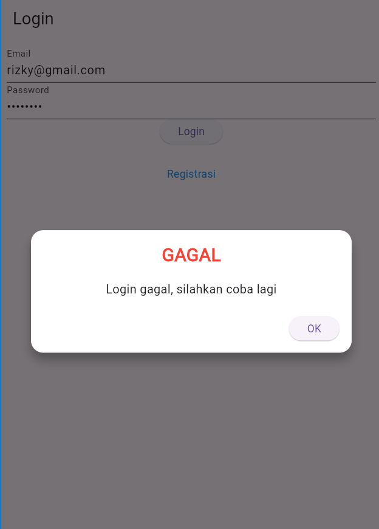
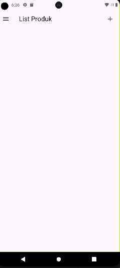
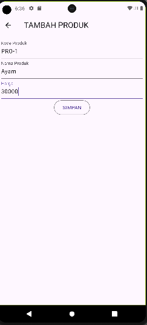
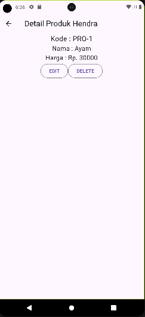
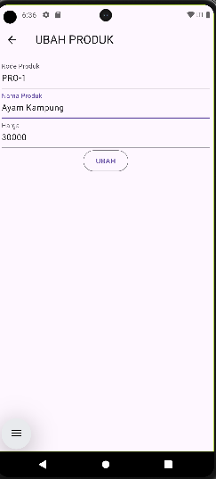
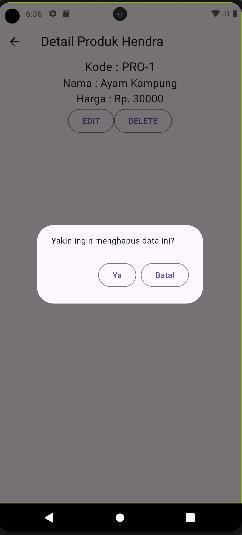

# Tugas Pertmeuan 5
## Registrasi

Masukkan Nama, Email, dan Password yang diinginkan untuk registrasi.
```dart
void _submit() {
    _formKey.currentState!.save();
    setState(() {
      _isLoading = true;
    });
    RegistrasiBloc.registrasi(
            nama: _namaTextboxController.text,
            email: _emailTextboxController.text,
            password: _passwordTextboxController.text)
        .then((value) {
      showDialog(
          context: context,
          barrierDismissible: false,
          builder: (BuildContext context) => SuccessDialog(
                description: "Registrasi berhasil, silahkan login",
                okClick: () {
                  Navigator.pop(context);
                },
              ));
    }, onError: (error) {
      showDialog(
          context: context,
          barrierDismissible: false,
          builder: (BuildContext context) => const WarningDialog(
                description: "Registrasi gagal, silahkan coba lagi",
              ));
    });
    setState(() {
      _isLoading = false;
    });
  }
```
Registrasi akan ditangani oleh function _submit.

## Login
Masukkan Email dan password yang telah terdaftar

Kalau salah akan muncul dialog gagal

Yang menangani login adalah 
```dart
void _submit() {
    _formKey.currentState!.save();
    setState(() {
      _isLoading = true;
    });
    LoginBloc.login(
            email: _emailTextboxController.text,
            password: _passwordTextboxController.text)
        .then((value) async {
      // print("Login successful: $value");
      if (value.userID != null) {
        await UserInfo().setToken(value.token ?? "");
        await UserInfo().setUserID(value.userID!);
        showDialog(
          context: context,
          barrierDismissible: false,
          builder: (BuildContext context) => SuccessDialog(
            description: "Login berhasil",
            okClick: () {
              Navigator.pushReplacement(
                context,
                MaterialPageRoute(
                  builder: (context) => const ProdukPage(),
                ),
              );
            },
          ),
        );
        Navigator.pushReplacement(context,
            MaterialPageRoute(builder: (context) => const ProdukPage()));
      } else {
        throw Exception("UserID is null");
      }
    }).catchError((error) {
      print("Login error: $error");
      showDialog(
          context: context,
          barrierDismissible: false,
          builder: (BuildContext context) => WarningDialog(
                description: "Login gagal: ${error.toString()}",
              ));
    }).whenComplete(() {
      setState(() {
        _isLoading = false;
      });
    });
  }
```
## Produk
Tampilan Produk Saat Masih Kosong

## Tambah Produk

Kode yang menanganinya adalah
```dart
simpan() {
    setState(() {
      _isLoading = true;
    });
    Produk createProduk = Produk(id: null);
    createProduk.kodeProduk = _kodeProdukTextboxController.text;
    createProduk.namaProduk = _namaProdukTextboxController.text;
    createProduk.hargaProduk = int.parse(_hargaProdukTextboxController.text);
    ProdukBloc.addProduk(produk: createProduk).then((value) {
      Navigator.of(context).push(MaterialPageRoute(
          builder: (BuildContext context) => const ProdukPage()));
    }, onError: (error) {
      showDialog(
          context: context,
          builder: (BuildContext context) => const WarningDialog(
                description: "Simpan gagal, silahkan coba lagi",
              ));
    });
    setState(() {
      _isLoading = false;
    });
  }
```
## Detail Produk
Klik 2 kali di sebuah produk untuk lihat detailnya

KOde Yang membuat detail muncul adalah 
```dart
class _ProdukDetailState extends State<ProdukDetail> {
  @override
  Widget build(BuildContext context) {
    return Scaffold(
      appBar: AppBar(
        title: const Text('Detail Produk Hendra'),
      ),
      body: Center(
        child: Column(
          children: [
            Text(
              "Kode : ${widget.produk!.kodeProduk}",
              style: const TextStyle(fontSize: 20.0),
            ),
            Text(
              "Nama : ${widget.produk!.namaProduk}",
              style: const TextStyle(fontSize: 18.0),
            ),
            Text(
              "Harga : Rp. ${widget.produk!.hargaProduk.toString()}",
              style: const TextStyle(fontSize: 18.0),
            ),
            _tombolHapusEdit()
          ],
        ),
      ),
    );
  }

  Widget _tombolHapusEdit() {
    return Row(
      mainAxisSize: MainAxisSize.min,
      children: [
// Tombol Edit
        OutlinedButton(
          child: const Text("EDIT"),
          onPressed: () {
            Navigator.push(
              context,
              MaterialPageRoute(
                builder: (context) => ProdukForm(
                  produk: widget.produk!,
                ),
              ),
            );
          },
        ),
// Tombol Hapus
        OutlinedButton(
          child: const Text("DELETE"),
          onPressed: () => confirmHapus(),
        ),
      ],
    );
  }

  void confirmHapus() {
    AlertDialog alertDialog = AlertDialog(
      content: const Text("Yakin ingin menghapus data ini?"),
      actions: [
//tombol hapus
        OutlinedButton(
          child: const Text("Ya"),
          onPressed: () {
            ProdukBloc.deleteProduk(id: int.parse(widget.produk!.id!)).then(
                (value) => {
                      Navigator.of(context).push(MaterialPageRoute(
                          builder: (context) => const ProdukPage()))
                    }, onError: (error) {
              showDialog(
                  context: context,
                  builder: (BuildContext context) => const WarningDialog(
                        description: "Hapus gagal, silahkan coba lagi",
                      ));
            });
          },
        ),
//tombol batal
        OutlinedButton(
          child: const Text("Batal"),
          onPressed: () => Navigator.pop(context),
        )
      ],
    );
    showDialog(builder: (context) => alertDialog, context: context);
  }
}
```
## Edit Produk

Kode yang menangani adalah
```dart
ubah() {
    setState(() {
      _isLoading = true;
    });
    Produk updateProduk = Produk(id: widget.produk!.id!);
    updateProduk.kodeProduk = _kodeProdukTextboxController.text;
    updateProduk.namaProduk = _namaProdukTextboxController.text;
    updateProduk.hargaProduk = int.parse(_hargaProdukTextboxController.text);
    ProdukBloc.updateProduk(produk: updateProduk).then((value) {
      Navigator.of(context).push(MaterialPageRoute(
          builder: (BuildContext context) => const ProdukPage()));
    }, onError: (error) {
      showDialog(
          context: context,
          builder: (BuildContext context) => const WarningDialog(
                description: "Permintaan ubah data gagal, silahkan coba lagi",
              ));
    });
    setState(() {
      _isLoading = false;
    });
  }
```
## Hapus Produk
Di dalam detail produk klik hapus

```dart
void confirmHapus() {
    AlertDialog alertDialog = AlertDialog(
      content: const Text("Yakin ingin menghapus data ini?"),
      actions: [
//tombol hapus
        OutlinedButton(
          child: const Text("Ya"),
          onPressed: () {
            ProdukBloc.deleteProduk(id: int.parse(widget.produk!.id!)).then(
                (value) => {
                      Navigator.of(context).push(MaterialPageRoute(
                          builder: (context) => const ProdukPage()))
                    }, onError: (error) {
              showDialog(
                  context: context,
                  builder: (BuildContext context) => const WarningDialog(
                        description: "Hapus gagal, silahkan coba lagi",
                      ));
            });
          },
        ),
//tombol batal
        OutlinedButton(
          child: const Text("Batal"),
          onPressed: () => Navigator.pop(context),
        )
      ],
    );
    showDialog(builder: (context) => alertDialog, context: context);
  }
```


